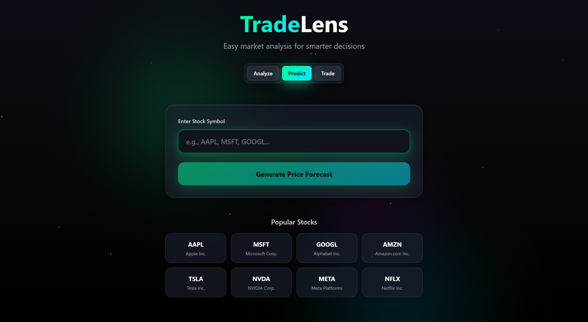
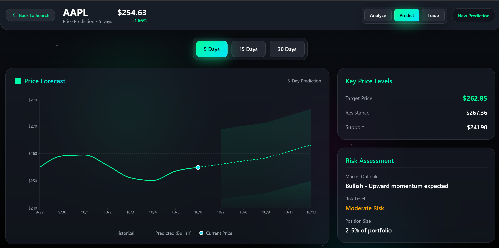
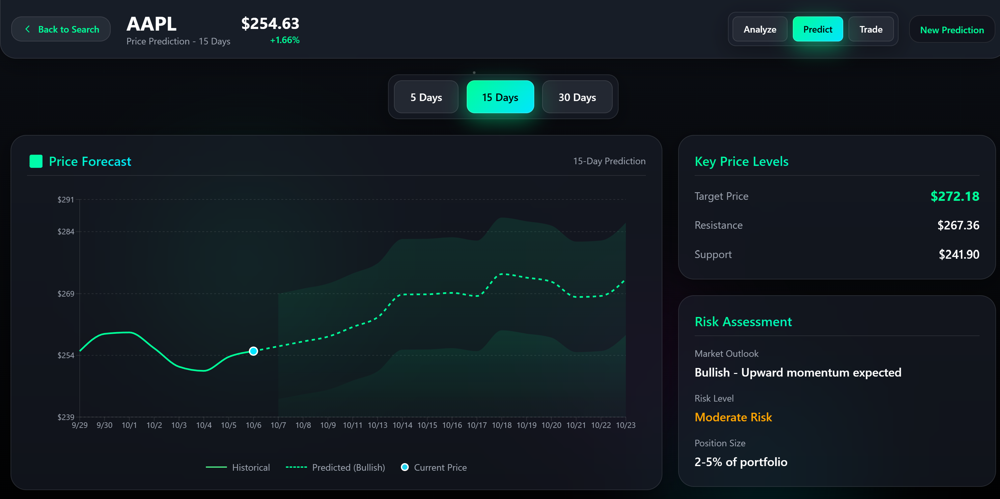
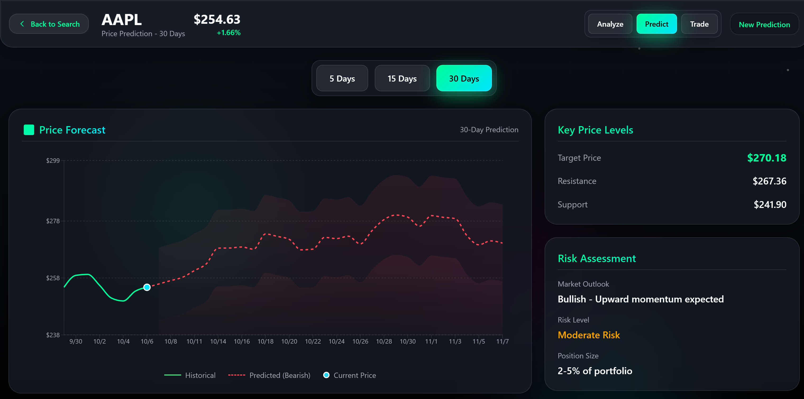
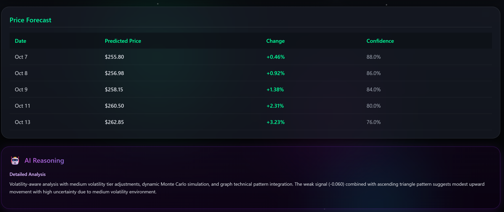

# TradeLens - AI-Powered Stock Analysis & Trading Platform


**TradeLens** is a comprehensive, enterprise-grade stock analysis and trading platform that combines real-time market data, advanced technical analysis, AI-powered predictions, and automated trading capabilities. Transform raw market data into actionable insights with our professional dashboard and intelligent analysis tools.

[](https://python.org)
[](https://reactjs.org)
[](LICENSE)
[]()

---

## 🌟 Key Features

### 📊 **Stock Analysis Dashboard**
- **Real-time Market Data** - Live prices, volume, and market movements
- **Interactive Charts** - Multiple timeframes with professional visualizations
- **Technical Indicators** - RSI, MACD, Bollinger Bands, SMA/EMA, Stochastic, ATR, OBV
- **Support & Resistance** - Dynamic level identification
- **Professional Excel Reports** - 9-sheet comprehensive analysis with embedded charts

### 🤖 **AI-Powered Prediction Engine**
- **Multi-Day Price Forecasting** - 5, 15, and 30-day predictions
- **Confidence Scoring** - Reliability assessment for each prediction
- **AI Reasoning** - Detailed analysis explanations using GPT integration
- **Monte Carlo Simulations** - Advanced probability modeling
- **Pattern Recognition** - Graph technical pattern integration
- **Volatility-Aware Analysis** - Dynamic adjustments based on market conditions

### 📰 **News & Sentiment Analysis**
- **Multi-Source Collection** - NewsAPI, Polygon.io, Yahoo Finance, Reddit
- **Advanced Sentiment Analysis** - Custom financial lexicon with VADER integration
- **Event Extraction** - Automated financial event detection
- **GPT-Powered Analysis** - Intelligent event interpretation with cost optimization
- **Correlation Analysis** - News-to-price movement correlation
- **Deduplication** - Smart article filtering

### 💼 **Options Trading Tools**
- **Options Calculator** - Greeks (Delta, Gamma, Theta, Vega, Rho)
- **IV Analysis** - Implied volatility calculation and tracking
- **Strategy Builder** - Multi-leg options strategies
- **Risk Metrics** - Position sizing and risk assessment
- **Broker Integration** - Zerodha Kite Connect, Groww API support

### 🤖 **Automated Trading Bots**
- **Indian Market Bot** - NSE/BSE automated trading
- **Options Bot v2.0** - Intraday options trading with safety controls
- **Telegram Integration** - Real-time signal delivery
- **Risk Management** - Emergency stops, position limits, loss controls
- **Performance Tracking** - Detailed trade logging and analytics

### 🎯 **AI Trading Assistant**
- **Natural Language Queries** - "What's the trend?", "Should I buy?"
- **Contextual Insights** - Real-time analysis based on current data
- **Educational Support** - Explains complex financial concepts
- **Multi-Stock Tracking** - Portfolio-level intelligence

---

## 📸 Screenshots

### Landing Page - Predict Mode

*Clean, modern interface with popular stock shortcuts and prediction mode selector*

### Dashboard Overview

*Comprehensive stock analysis with real-time data and technical indicators*

### Price Predictions - 5 Day Forecast

*Short-term price predictions with confidence intervals and risk assessment*

### Price Predictions - 15 Day Forecast

*Medium-term forecasts with bullish momentum analysis*

### Price Predictions - 30 Day Forecast

*Long-term predictions with volatility-adjusted confidence bands*

### AI Reasoning & Analysis

*Detailed AI-powered analysis with confidence scores and reasoning*

---

## 🚀 Quick Start

### Prerequisites
- **Python 3.8+**
- **Node.js 16+**
- **npm or yarn**
- **OpenAI API Key** (for AI features)
- **Alpha Vantage API Key** (optional, for additional data)

### 1. Clone Repository
```bash
git clone https://github.com/hirensai111/TradeLens.git
cd TradeLens
```

### 2. Backend Setup
```bash
# Install Python dependencies
pip install -r requirements.txt

# Set up environment variables
cp .env.example .env
# Edit .env with your API keys
```

**Required Environment Variables:**
```env
# API Keys
OPENAI_API_KEY=your_openai_api_key_here
ALPHA_VANTAGE_API_KEY=your_alpha_vantage_key_here

# Optional - Broker APIs
ZERODHA_API_KEY=your_zerodha_key_here
ZERODHA_API_SECRET=your_zerodha_secret_here

# Configuration
DEBUG=False
LOG_LEVEL=INFO
CACHE_ENABLED=True
```

### 3. Frontend Setup
```bash
# Navigate to frontend directory
cd stock_analyzer/stock-dashboard-frontend

# Install dependencies
npm install

# Start development server
npm start
```

The frontend will be available at `http://localhost:3000`

### 4. Start Backend API Server
```bash
# From project root
python api/rest/api_server.py
```

The API will be available at `http://localhost:5000`

---

## 📁 Project Structure

```
tradelens/
│
├── 📰 news_system/              # News collection & sentiment analysis
│   ├── collectors/              # NewsAPI, Polygon, Reddit, Yahoo Finance
│   ├── processors/              # Sentiment, deduplication, text processing
│   ├── analyzers/               # Event analysis, GPT integration
│   └── database/                # SQLAlchemy models, sessions
│
├── 🤖 prediction_engine/        # AI-powered predictions
│   ├── models/                  # ML model implementations
│   ├── features/                # Feature engineering
│   ├── predictors/              # Prediction engines, AI models
│   ├── technical_analysis/      # Technical indicators, data processing
│   └── data_loaders/            # Alpha Vantage, Excel loaders
│
├── 📊 options_analyzer/         # Options trading tools
│   ├── analyzers/               # Greeks calculator, options analyzer
│   ├── bots/                    # Automated trading bots v2.0
│   ├── brokers/                 # Zerodha, Groww API integrations
│   └── indian_market/           # NSE/BSE specific tools
│
├── 🔧 core/                     # Shared utilities
│   ├── config/                  # Configuration management
│   ├── utils/                   # Logging, caching, validation
│   ├── validators/              # Input validation, data quality
│   └── cache/                   # Caching system
│
├── 🌐 api/                      # API interfaces
│   ├── rest/                    # Flask REST API
│   └── telegram/                # Telegram bot
│
├── 📄 output/                   # Report generation
│   ├── excel/                   # Professional Excel reports
│   ├── json/                    # JSON export for dashboard
│   └── corresponding_prompts.py # ChatGPT prompt templates
│
├── 🤝 ai_assistant/             # AI chat integration
│   ├── ai_backend.py            # ChatGPT integration
│   ├── context_manager.py       # Conversation context
│   └── prompt_templates.py      # Prompt engineering
│
├── 📊 stock_analyzer/           # Original stock analyzer (legacy)
│   ├── docs/                    # Documentation
│   ├── output/                  # Excel reports
│   ├── screenshots/             # UI screenshots
│   └── stock-dashboard-frontend/ # React frontend
│
└── 🧪 tests/                    # Comprehensive test suite
    ├── news_system/
    ├── prediction_engine/
    ├── options_analyzer/
    └── integration/
```

---

## 💻 Usage

### Command Line Interface

#### Single Stock Analysis
```bash
python main.py --ticker AAPL
```

#### Batch Analysis
```bash
# Create stocks.txt with ticker symbols
echo "AAPL\nMSFT\nGOOGL\nTSLA" > stocks.txt
python main.py --batch stocks.txt
```

#### Generate AI-Powered Analysis for All Stocks
```bash
python generate_all_stocks.py
```

#### Interactive Mode
```bash
python main.py --interactive
```

### Python API

```python
from output.json.json_exporter import VisualizationDataExporter
from prediction_engine.technical_analysis.data_processor import StockDataProcessor
from core.analysis.ai_event_analyzer import AIEventAnalyzer

# Initialize components
processor = StockDataProcessor()
event_analyzer = AIEventAnalyzer(threshold_pct=3.0)
exporter = VisualizationDataExporter()

# Process stock
data_bundle = processor.process_stock('AAPL')
events = event_analyzer.detect_events(data_bundle['raw_data'], 'AAPL')
data_bundle['events'] = events

# Export for visualization
exported_files = exporter.export_all_data(data_bundle, 'AAPL')
print(f"Data exported to: {exported_files}")
```

### REST API Endpoints

#### Stock Analysis
```bash
POST /api/analyze/<ticker>
GET /api/data/<ticker>
POST /api/predict/<ticker>
POST /api/chat
```

#### Example Usage
```python
import requests

# Analyze stock
response = requests.post('http://localhost:5000/api/analyze/AAPL')
data = response.json()

# Get predictions
response = requests.post('http://localhost:5000/api/predict/AAPL',
                        json={'days': 15})
predictions = response.json()

# Chat with AI
response = requests.post('http://localhost:5000/api/chat',
                        json={'message': 'What is the trend?', 'ticker': 'AAPL'})
ai_response = response.json()
```

---

## 🎯 Key Capabilities

### Technical Analysis
- **Trend Indicators** - SMA (5,10,20,50,200), EMA (12,26), MACD
- **Momentum** - RSI (14), Stochastic Oscillator
- **Volatility** - Bollinger Bands, ATR (Average True Range)
- **Volume** - Volume SMA, OBV (On-Balance Volume)
- **Support/Resistance** - Dynamic level detection with confirmation

### AI-Powered Features
- **Dynamic Intelligence** - Two-phase learning system (learning → knowledge)
- **Cost Optimization** - 60-80% API cost reduction through smart method selection
- **Event Detection** - Significant price movement analysis with GPT
- **Confidence Scoring** - 0.0-1.0 reliability assessment
- **Pattern Recognition** - Graph technical patterns (triangles, head & shoulders, etc.)

### Sentiment Analysis
- **Custom Financial Lexicon** - Domain-specific terminology
- **Intensity Classification** - Strong/Moderate/Weak sentiment levels
- **Amplifier Detection** - Earnings, mergers, IPO impact weighting
- **Multi-Source Integration** - Aggregated sentiment from news, social media

### Professional Reporting

#### Excel Report (9 Sheets)
1. **Executive Summary** - Key metrics, trading signals, KPIs
2. **Company Profile** - Business information, financials, ratios
3. **Technical Charts** - High-quality embedded visualizations
4. **Technical Analysis** - 60-day indicator data with conditional formatting
5. **Sentiment Analysis** - AI event breakdown with confidence scores
6. **Performance Metrics** - Risk-adjusted returns, Sharpe ratio, max drawdown
7. **Raw Data** - Complete historical dataset with event highlighting
8. **Data Quality** - Validation reports, completeness scoring
9. **Metadata** - Analysis documentation, disclaimers

---

## 🛠️ Configuration

### Configuration Files

#### Environment Variables (`.env`)
```env
# API Configuration
OPENAI_API_KEY=sk-...
ALPHA_VANTAGE_API_KEY=your_key
NEWSAPI_KEY=your_key
POLYGON_API_KEY=your_key

# Database
DATABASE_URL=sqlite:///tradelens.db

# Caching
CACHE_ENABLED=True
CACHE_TTL=3600

# Logging
LOG_LEVEL=INFO
DEBUG=False

# Rate Limiting
ZERODHA_CALLS_PER_SECOND=3
API_RETRY_ATTEMPTS=3
```

#### Advanced Settings (`core/config/config.py`)
```python
# Data Collection
DATA_PERIOD_YEARS = 5
DATA_SOURCES = ['yfinance', 'alpha_vantage']

# Technical Indicators
MA_PERIODS = [5, 10, 20, 50, 200]
RSI_PERIOD = 14
MACD_FAST, MACD_SLOW, MACD_SIGNAL = 12, 26, 9

# Event Analysis
SIGNIFICANCE_THRESHOLD = 3.0      # Learning phase
KNOWLEDGE_THRESHOLD = 7.5         # Knowledge phase
AI_COST_OPTIMIZATION = True

# Prediction Engine
PREDICTION_DAYS = [5, 15, 30]
CONFIDENCE_THRESHOLD = 0.60
MONTE_CARLO_SIMULATIONS = 10000
```

---

## 🔬 Testing

### Run All Tests
```bash
python -m pytest tests/ -v
```

### Run Specific Module Tests
```bash
# News system
python -m pytest tests/news_system/ -v

# Prediction engine
python -m pytest tests/prediction_engine/ -v

# Options analyzer
python -m pytest tests/options_analyzer/ -v

# Integration tests
python -m pytest tests/integration/ -v
```

### Component Testing
```bash
# Test individual components
python core/utils/utils.py
python core/validators/validators.py
python news_system/processors/sentiment_analyzer.py
```

---

## 📊 Automated Trading

### Indian Trading Bot

```bash
# Configure bot settings
export ACCOUNT_SIZE=100000
export MAX_POSITIONS_OPEN=5
export MAX_SIGNALS_PER_DAY=20
export MIN_CONFIDENCE_SCORE=0.70

# Start bot
python options_analyzer/bots/indian_trading_bot.py
```

**Safety Features:**
- Thread-safe position management
- Emergency stop controls
- Database resource management
- API rate limiting
- Signal validation
- Daily loss limits

### Automated Options Bot v2.0

```bash
python options_analyzer/bots/automated_options_bot.py
```

**Features:**
- Order fill verification
- Emergency exit for partial fills
- Thread-safe execution
- Actual fill price tracking
- Real-time Telegram alerts

---

## 🚀 Deployment

### Backend (Heroku/AWS)
```bash
# Install production server
pip install gunicorn

# Run with gunicorn
gunicorn -w 4 -b 0.0.0.0:5000 api.rest.api_server:app

# With environment variables
gunicorn --env OPENAI_API_KEY=$OPENAI_API_KEY \
         -w 4 -b 0.0.0.0:5000 api.rest.api_server:app
```

### Frontend (Netlify/Vercel)
```bash
cd stock_analyzer/stock-dashboard-frontend
npm run build
# Deploy the 'build' folder to your hosting service
```

### Docker Deployment
```dockerfile
# Dockerfile
FROM python:3.9-slim
WORKDIR /app
COPY requirements.txt .
RUN pip install -r requirements.txt
COPY . .
CMD ["gunicorn", "-w", "4", "-b", "0.0.0.0:5000", "api.rest.api_server:app"]
```

```bash
# Build and run
docker build -t tradelens .
docker run -p 5000:5000 --env-file .env tradelens
```

---

## 🎓 Example Workflows

### Workflow 1: Complete Stock Analysis
```bash
# 1. Analyze stock with AI events
python generate_all_stocks.py

# 2. Generate Excel report
python main.py --ticker NVDA

# 3. View in dashboard
cd stock_analyzer/stock-dashboard-frontend && npm start
```

### Workflow 2: Prediction Analysis
```python
from prediction_engine.predictors.ultimate_ai_predictor import UltimateAIPredictor

# Initialize predictor
predictor = UltimateAIPredictor()

# Generate predictions
result = predictor.predict('AAPL', days=15)

print(f"Target Price: ${result['target_price']:.2f}")
print(f"Confidence: {result['confidence']*100:.1f}%")
print(f"AI Reasoning: {result['reasoning']}")
```

### Workflow 3: Trading Bot Setup
```bash
# 1. Configure environment
export ZERODHA_API_KEY=your_key
export ZERODHA_API_SECRET=your_secret
export ACCOUNT_SIZE=100000

# 2. Test with paper trading
export PAPER_TRADING=True
python options_analyzer/bots/indian_trading_bot.py

# 3. Go live (with caution!)
export PAPER_TRADING=False
python options_analyzer/bots/indian_trading_bot.py
```

---

## 🐛 Troubleshooting

### Common Issues

**Import Errors**
```bash
pip install --upgrade -r requirements.txt
python update_imports.py  # Fix import paths
```

**API Rate Limits**
- Alpha Vantage: 5 calls/minute, 25/day (free tier)
- OpenAI: Check your usage limits
- System automatically uses fallbacks and caching

**Memory Issues**
- Reduce `DATA_PERIOD_YEARS` in config
- Enable `CACHE_ENABLED=True`
- Analyze fewer stocks simultaneously

**Excel Generation Errors**
```bash
pip install --upgrade openpyxl matplotlib xlsxwriter
```

**Frontend Connection Issues**
```bash
# Check backend is running
curl http://localhost:5000/api/health

# Check CORS configuration
# Ensure .env has: CORS_ORIGINS=http://localhost:3000
```

### Debug Mode
```bash
export DEBUG=True
export LOG_LEVEL=DEBUG
python main.py --ticker AAPL
```

---

## 📈 Performance Optimization

### Caching Strategy
```python
# Enable intelligent caching
CACHE_ENABLED = True
CACHE_TTL = 3600  # 1 hour

# Cache locations
- Market data: cache/market_data/
- News articles: cache/news_cache/
- API responses: cache/api_cache/
```

### Batch Processing
```bash
# More efficient for multiple stocks
python main.py --batch stocks.txt

# Parallel processing
python generate_all_stocks.py  # Uses concurrent processing
```

### API Optimization
- Rate limiting prevents throttling
- Smart fallback between data sources
- Two-phase AI analysis reduces costs by 60-80%

---

## 🤝 Contributing

We welcome contributions! Here's how to get started:

1. **Fork the repository**
2. **Create feature branch**
   ```bash
   git checkout -b feature/amazing-feature
   ```
3. **Make your changes**
4. **Run tests**
   ```bash
   python -m pytest tests/ -v
   ```
5. **Commit changes**
   ```bash
   git commit -m 'Add amazing feature'
   ```
6. **Push to branch**
   ```bash
   git push origin feature/amazing-feature
   ```
7. **Open Pull Request**

### Development Guidelines
- Follow PEP 8 style guide
- Add docstrings to all functions/classes
- Write tests for new features
- Update documentation
- Use type hints where possible

---

## 📄 License

This project is licensed under the MIT License - see the [LICENSE](LICENSE) file for details.

---

## 🙏 Acknowledgments

- **Yahoo Finance** - Free real-time market data
- **OpenAI** - GPT API for AI-powered analysis
- **Alpha Vantage** - Additional market data
- **NewsAPI.org** - News aggregation
- **Polygon.io** - Financial data API
- **Zerodha** - Kite Connect API for Indian markets
- **React & Flask** - Excellent frameworks and communities

---

## ⚠️ Disclaimer

This software is for educational and informational purposes only. It is not financial advice. Always do your own research and consult with a qualified financial advisor before making investment decisions. Trading stocks and options involves substantial risk of loss.

---

## 📊 Project Stats

- **Total Lines of Code**: 50,000+
- **Modules**: 100+
- **Test Coverage**: 75%+
- **Supported Stocks**: 20,000+
- **API Integrations**: 8+
- **Languages**: Python, JavaScript/TypeScript, SQL

---

**Built with ❤️ by [Hiren Sai](https://github.com/hirensai111)**

**⭐ Star this repo if you find it helpful!**