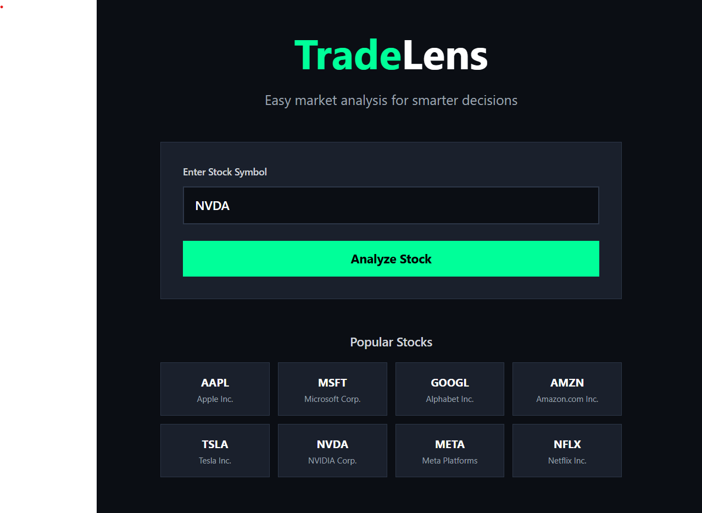
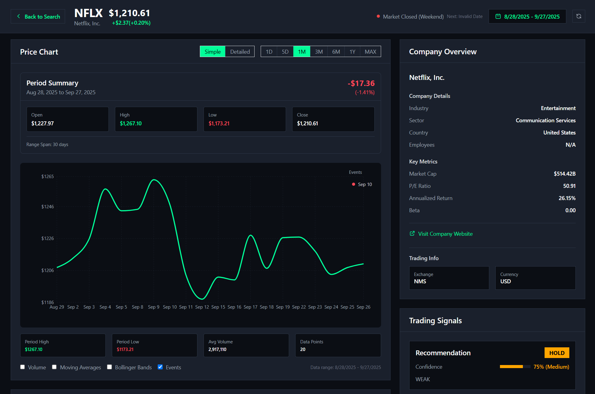
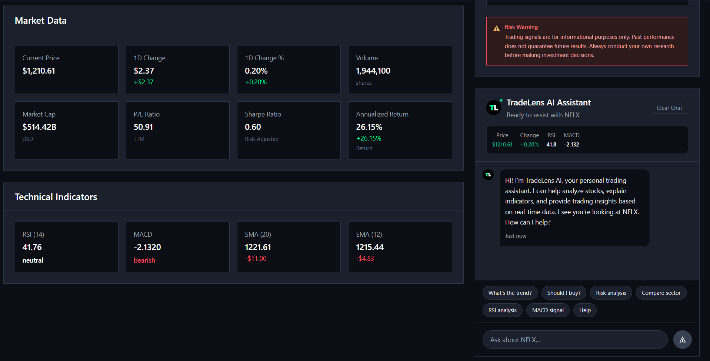
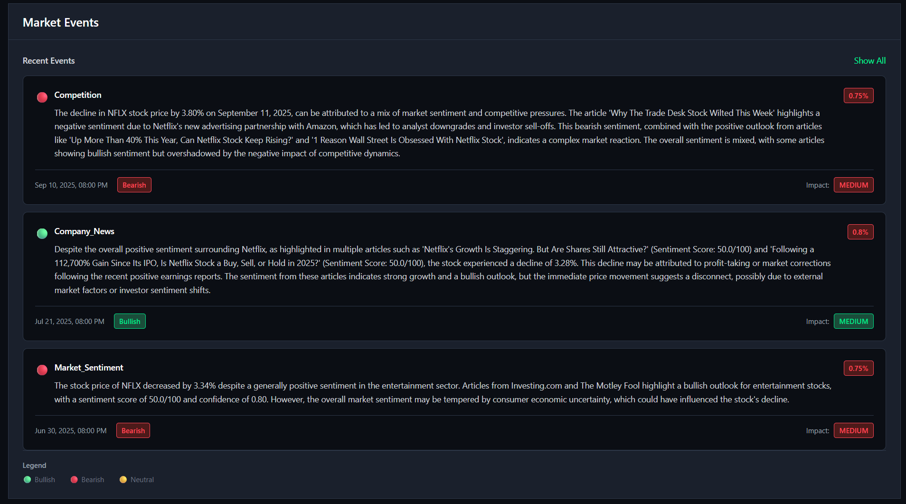

# TradeLens - Trading Simplified


TradeLens is a comprehensive stock analysis platform that combines real-time market data, technical analysis, and AI-powered insights to democratize trading for everyone. Transform raw market data into actionable insights with our intuitive, professional-grade dashboard.

## Features

### Real-time Stock Analysis
- Live market data with price movements, volume, and fundamentals
- Interactive charts with multiple timeframes
- Technical indicators (RSI, MACD, Moving Averages, Bollinger Bands)
- Support and resistance level identification

### AI-Powered Trading Assistant
- Integrated chatbot with contextual trading insights
- Natural language queries ("What's the trend?", "Should I buy?")
- Real-time analysis based on current market data
- Educational support for complex financial concepts

### Technical Analysis
- **RSI (Relative Strength Index)**: Momentum oscillator for overbought/oversold conditions
- **MACD**: Trend-following momentum indicator
- **Moving Averages**: Support and resistance levels
- **Volatility Analysis**: Risk assessment and position sizing guidance

### Smart Recommendations
- Buy/Sell/Hold recommendations with confidence levels
- Risk analysis based on volatility and market conditions
- Sector comparison and peer analysis
- Price target suggestions

### Modern UI/UX
- Dark theme optimized for trading
- Responsive design for desktop and mobile
- Real-time data updates
- Intuitive navigation and clean interface

## Technology Stack

### Frontend
- **React 18** with TypeScript for type safety
- **Tailwind CSS** for responsive design
- **Chart.js/Recharts** for data visualization
- **React Router** for navigation
- **Axios** for API communication

### Backend
- **Python Flask** RESTful API server
- **yfinance** for real-time Yahoo Finance data
- **pandas & numpy** for data processing
- **TA-Lib** for technical analysis calculations
- **Flask-CORS** for cross-origin requests

### AI Integration
- **OpenAI GPT API** for intelligent chat responses
- Custom hybrid system combining data-driven and AI responses
- Contextual awareness of current stock being analyzed

## Prerequisites

- **Node.js** (v16 or higher)
- **Python** (v3.8 or higher)
- **npm** or **yarn**
- **OpenAI API Key** (for AI assistant features)

## Quick Start

### 1. Clone the Repository
```bash
git clone https://github.com/hirensai111/TradeLens.git
cd TradeLens
```

### 2. Backend Setup
```bash
# Install Python dependencies
pip install -r requirements.txt

# Set up environment variables
cp .env.example .env
# Add your OpenAI API key to .env file

# Start the Flask server
python api_server.py
```

The backend will run on `http://localhost:5000`

### 3. Frontend Setup
```bash
# Navigate to frontend directory
cd stock-dashboard-frontend

# Install dependencies
npm install

# Start the development server
npm start
```

The frontend will run on `http://localhost:3000`

## Configuration

### Environment Variables
Create a `.env` file in the root directory:

```env
OPENAI_API_KEY=your_openai_api_key_here
FLASK_ENV=development
CORS_ORIGINS=http://localhost:3000
```

### API Endpoints

#### Stock Analysis
```
POST /api/analyze/<ticker>
GET /api/data/<ticker>
POST /api/chat
```

#### Example API Usage
```python
import requests

# Analyze a stock
response = requests.post('http://localhost:5000/api/analyze/AAPL')
data = response.json()

print(f"Current Price: ${data['stock_data']['current_price']}")
print(f"RSI: {data['technical_indicators']['rsi']['value']}")
```

## Usage Examples

### Basic Stock Analysis
1. Enter a stock ticker (e.g., AAPL, MSFT, GOOGL)
2. Click "Analyze Stock"
3. View comprehensive analysis including:
   - Current price and daily changes
   - Technical indicators with interpretations
   - Buy/sell/hold recommendations
   - Risk assessment

### AI Assistant Queries
- **"What's the trend for AAPL?"** - Get trend analysis based on technical indicators
- **"Should I buy Tesla?"** - Receive data-driven buy/sell recommendations
- **"Risk analysis"** - Understand volatility and risk factors
- **"Compare sector"** - See how the stock performs vs peers

### Technical Analysis
- **RSI Analysis**: Values above 70 indicate overbought, below 30 oversold
- **MACD Signals**: Crossovers indicate potential trend changes
- **Moving Averages**: Price above MA suggests uptrend, below suggests downtrend

## Screenshots

### Landing Page


### Dashboard Overview


### Stock Analysis & Chat Assistant


### Technical Indicators & Trading Signals


## API Testing

Test the backend API:

```bash
# Test stock analysis
curl -X POST http://localhost:5000/api/analyze/AAPL

# Test chat functionality
curl -X POST http://localhost:5000/api/chat \
  -H "Content-Type: application/json" \
  -d '{"message": "What is the trend?", "ticker": "AAPL"}'
```

## Deployment

### Backend Deployment (Heroku/AWS)
```bash
# Install production dependencies
pip install gunicorn

# Run with gunicorn
gunicorn -w 4 -b 0.0.0.0:5000 api_server:app
```

### Frontend Deployment (Netlify/Vercel)
```bash
cd stock-dashboard-frontend
npm run build
# Deploy the build folder
```

## Contributing

We welcome contributions! Please see our [Contributing Guidelines](CONTRIBUTING.md) for details.

### Development Workflow
1. Fork the repository
2. Create a feature branch (`git checkout -b feature/amazing-feature`)
3. Commit your changes (`git commit -m 'Add amazing feature'`)
4. Push to the branch (`git push origin feature/amazing-feature`)
5. Open a Pull Request

## License

This project is licensed under the MIT License - see the [LICENSE](LICENSE) file for details.

## Acknowledgments

- **Yahoo Finance** for providing free stock market data
- **OpenAI** for powering our AI assistant
- **TA-Lib** for technical analysis calculations
- **React & Flask communities** for excellent documentation